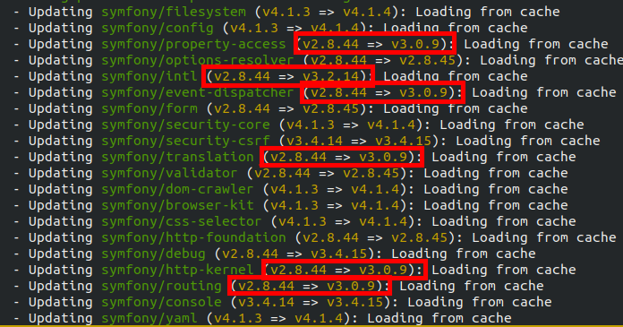
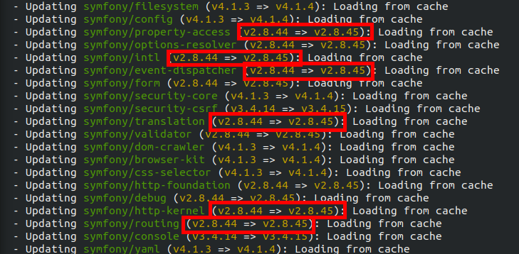

Enforcing LTS or Current Versions of the Symfony Components
===========================================================

Using `symfony/symfony` makes Composer install all Symfony Components, all in
the same version. But when using the standalone packages, Composer might
install dependencies in a different major version (`symfony/validator` v2.8
is compatible with `symfony/translation` v3.0 for instance).

This is fine if you don't want to stick to Symfony LTS versions and if your
code does not use these transitive dependencies.

This package allows you to force Composer to always use an LTS or current
version of Symfony Components, whether they are explicitly listed as a
project's dependency or installed transitively.

For example, without this metapackage, running `composer update` may result in
upgrading some packages to unsupported versions:



By requiring this package, Composer will ensure you never `update` to an
unsupported version:



Note that this package is meant to be used by projects. Library authors SHOULD
NOT use it, except maybe in the `"require-dev"` Composer section.

This package is similar to [`symfony/lts`](https://github.com/symfony/lts),
but instead allows mixing and matching of different major versions provided
they are all LTS or current. See <https://symfony.com/roadmap> for the latest
information on supported versions.

Usage
-----

Use the Composer command line:

```bash
composer require colinodell/symfony-lts-or-current dev-master
```

Versioning Policy
------------------

Because support for LTS and current versions changes over time, this package
is only available as `dev-master`.
